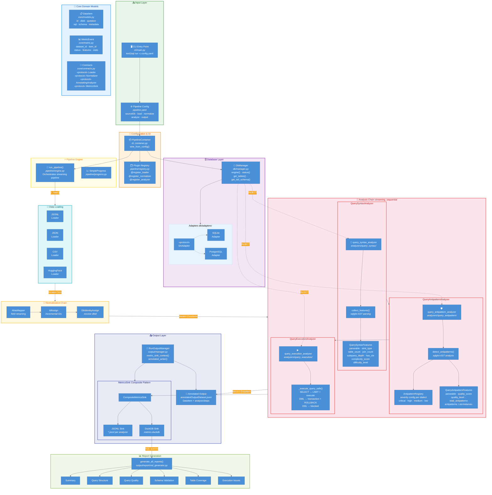

# Text2SQL Dataset Analyzer — Architecture



## Data Flow Summary

```
pipeline.yaml
      │
      ▼
┌─────────────────────────┐
│   PipelineContainer     │ ◄── wire_from_config() + Plugin Registry
│   (DI / dependency-     │     @register_loader / @register_analyzer
│    injector)            │
└────────┬────────────────┘
         │
         ▼
┌─────────────────────────┐
│   Loader                │  JSONL / JSON / CSV / HuggingFace
│   load() → Iterator     │
└────────┬────────────────┘
         │  Iterator[Dict]
         ▼
┌─────────────────────────┐
│   Normalizer Chain      │  AliasMapper → IdAssign → DbIdentityAssign
│   normalize_stream()    │
└────────┬────────────────┘
         │  Iterator[DataItem]
         ▼
┌─────────────────────────────────────────────────────────────────┐
│   Analyzer Chain  (streaming, item-by-item, sequential)         │
│                                                                 │
│   ┌───────────────────┐  ┌────────────────────┐  ┌───────────┐│
│   │ QuerySyntax       │→ │ QueryAntipattern   │→ │ QueryExec ││
│   │ Analyzer          │  │ Analyzer           │  │ Analyzer  ││
│   │                   │  │                    │  │           ││
│   │ • sqlglot parse   │  │ • AST antipattern  │  │ • safe    ││
│   │ • complexity      │  │   detection        │  │   execute ││
│   │   scoring         │  │ • severity levels  │  │ • timeout ││
│   │ • difficulty      │  │ • quality score    │  │ • rollback││
│   │   classification  │  │   (0-100)          │  │           ││
│   └───────────────────┘  └────────────────────┘  └───────────┘│
│         │                        │                      │      │
│         └────────────┬───────────┴──────────────────────┘      │
│                      ▼                                         │
│              MetricEvent + annotated DataItem                  │
└──────────────────────┬─────────────────────────────────────────┘
                       │
              ┌────────┴────────┐
              ▼                 ▼
    ┌──────────────┐   ┌────────────────────────┐
    │ MetricsSink  │   │ Annotated Output       │
    │ (Composite)  │   │ annotatedOutputDataset  │
    │              │   │ .jsonl                  │
    │ ┌──────────┐ │   └────────────────────────┘
    │ │JSONL Sink│ │
    │ └──────────┘ │
    │ ┌──────────┐ │
    │ │DuckDB    │─┼──────► Report Generation
    │ │Sink      │ │        (7 Markdown reports)
    │ └──────────┘ │
    └──────────────┘
```

## Key Design Patterns

| Pattern | Where | Description |
|---|---|---|
| **Protocol-based contracts** | `core/contracts.py` | `Loader`, `Normalizer`, `AnnotatingAnalyzer`, `MetricsSink` — structural typing |
| **Plugin Registry** | `pipeline/registry.py` | `@register_analyzer()` decorator auto-registers classes by name |
| **DI Container** | `di_container.py` | `PipelineContainer` wires dependencies via `INJECT` class attribute |
| **Streaming Pipeline** | `pipeline/engine.py` | Lazy `Iterator[DataItem]` chain — constant memory regardless of dataset size |
| **Composite Sink** | `output/sinks/composite.py` | Single `MetricsSink` fans out to JSONL + DuckDB simultaneously |
| **Builder** | `core/metric.py` | `MetricEventBuilder` for boilerplate-free metric construction |
